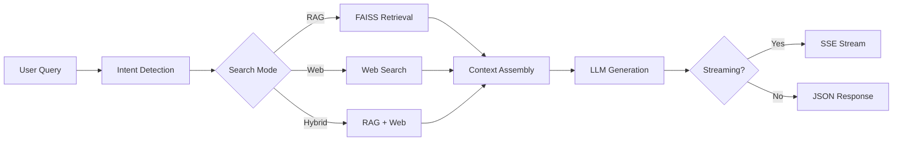

# Agentic RAG Engine

[](https://www.python.org/downloads/)
[](https://fastapi.tiangolo.com)
[](https://openai.com)
[](https://github.com/facebookresearch/faiss)
[](LICENSE)

Production-grade Retrieval-Augmented Generation engine with multi-project FAISS indexing, hybrid search modes (RAG/Web/Hybrid), streaming SSE responses, conversation memory, and hallucination rollback.

---

## Architecture



## Features

- **Multi-project FAISS vector indexing** with LRU embedding cache
- **Hybrid search**: RAG (document retrieval), Web, and combined modes
- **Server-Sent Events (SSE) streaming** for real-time responses
- **Conversation memory** with session management
- **Hallucination rollback** with confidence scoring
- **S3-compatible storage backend** (local or cloud)
- **OpenAI GPT-4o powered generation**

## Tech Stack

| Component | Technology |
|-----------|-----------|
| Framework | FastAPI |
| LLM | OpenAI GPT-4o |
| Embeddings | text-embedding-3-small |
| Vector Store | FAISS |
| Storage | Local / AWS S3 |
| Streaming | SSE (Server-Sent Events) |

## Quick Start

```bash
git clone https://github.com/AniruddhaPKawarase/agentic-rag-engine.git
cd agentic-rag-engine
python -m venv venv
source venv/bin/activate  # Windows: venv\Scripts\activate
pip install -r requirements.txt
cp .env.example .env
# Edit .env with your OpenAI API key
uvicorn generate:app --host 0.0.0.0 --port 8001
```

## API Reference

| Method | Endpoint | Description |
|--------|----------|-------------|
| GET | `/` | API info and available endpoints |
| GET | `/health` | Health check with optional project_id |
| GET | `/config` | Configuration details (models, features) |
| POST | `/query` | Main query — RAG/web/hybrid with follow-ups |
| POST | `/quick-query` | Simplified query for UI integration |
| POST | `/query/stream` | Streaming answer via SSE |
| POST | `/web-search` | Web search only |
| POST | `/sessions/create` | Create conversation session |
| GET | `/sessions` | List active sessions |
| GET | `/sessions/{id}/stats` | Session statistics |
| POST | `/sessions/{id}/update` | Update session context |
| DELETE | `/sessions/{id}` | Delete session |

### Examples

**Query (RAG mode):**

```bash
curl -X POST http://localhost:8001/query \
  -H "Content-Type: application/json" \
  -d '{
    "question": "What are the plumbing specifications for this project?",
    "project_id": 7166,
    "mode": "rag"
  }'
```

**Streaming query (SSE):**

```bash
curl -N -X POST http://localhost:8001/query/stream \
  -H "Content-Type: application/json" \
  -d '{
    "question": "Summarize the electrical drawings",
    "project_id": 7166,
    "mode": "hybrid"
  }'
```

## Project Structure

```
agentic-rag-engine/
├── generate.py              # Main entry point (FastAPI app)
├── retrieve.py              # Multi-project FAISS retrieval
├── memory_manager.py        # Conversation session manager
├── requirements.txt
├── config/
│   └── settings.py          # Environment configuration
├── rag/
│   ├── api/
│   │   ├── state.py         # FastAPI app bootstrap
│   │   ├── models.py        # Request/response schemas
│   │   ├── routes.py        # API endpoint handlers
│   │   ├── generation_unified.py  # RAG/web/hybrid generation
│   │   ├── streaming.py     # SSE streaming handler
│   │   ├── prompts.py       # Prompt templates
│   │   └── helpers.py       # Context formatting utilities
│   └── retrieval/
│       ├── state.py         # Retrieval constants & OpenAI client
│       ├── loaders.py       # FAISS index & metadata loading
│       ├── metadata.py      # Metadata normalization
│       ├── embeddings.py    # Embedding & similarity helpers
│       ├── engine.py        # Core retrieval functions
│       └── diagnostics.py   # Project stats & test helpers
├── s3_utils/                # S3 storage integration
├── services/
│   └── web_search.py        # Web search integration
├── scripts/                 # Migration scripts
└── tests/                   # Test suite
```

## Environment Variables

| Variable | Required | Default | Description |
|----------|----------|---------|-------------|
| `OPENAI_API_KEY` | Yes | — | OpenAI API key |
| `LLM_MODEL` | No | `gpt-4o` | LLM model for generation |
| `WEB_SEARCH_MODEL` | No | `gpt-4.1` | Model for web search |
| `EMBEDDING_MODEL` | No | `text-embedding-3-small` | Embedding model |
| `HOST` | No | `0.0.0.0` | Server bind address |
| `PORT` | No | `8001` | Server port |
| `SESSION_STORAGE_PATH` | No | `./conversation_sessions` | Session file storage |
| `MAX_SESSIONS` | No | `100` | Maximum concurrent sessions |
| `MAX_TOKENS_PER_SESSION` | No | `100000` | Token limit per session |
| `LOG_LEVEL` | No | `INFO` | Logging level |
| `LOG_TO_FILE` | No | `false` | Enable file logging |
| `LOG_FILE_PATH` | No | `./logs/app.log` | Log file path |
| `INDEX_ROOT` | No | `./index` | FAISS index storage directory |
| `STORAGE_BACKEND` | No | `local` | Storage backend (`local` or `s3`) |
| `S3_BUCKET_NAME` | No | — | S3 bucket name |
| `S3_REGION` | No | `us-east-1` | AWS region |
| `AWS_ACCESS_KEY_ID` | No | — | AWS access key |
| `AWS_SECRET_ACCESS_KEY` | No | — | AWS secret key |
| `S3_AGENT_PREFIX` | No | `rag-agent` | S3 key prefix |

## Contributing

1. Fork the repository
2. Create a feature branch (`git checkout -b feature/your-feature`)
3. Commit your changes (`git commit -m 'Add your feature'`)
4. Push to the branch (`git push origin feature/your-feature`)
5. Open a Pull Request

## License

This project is licensed under the MIT License. See [LICENSE](LICENSE) for details.
